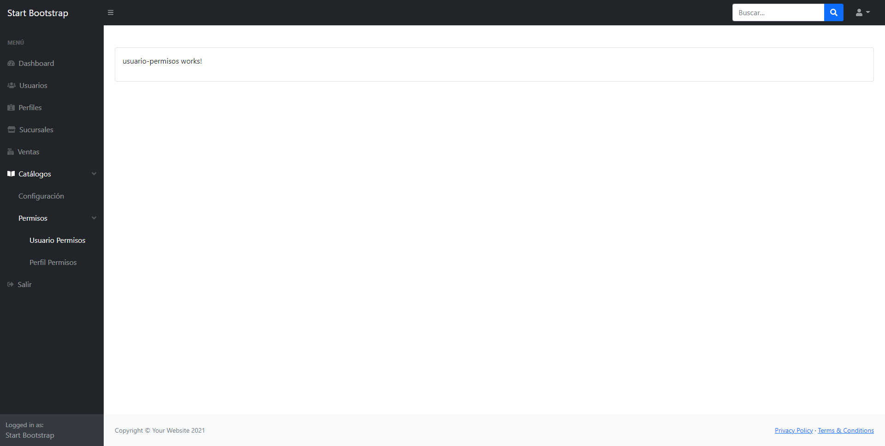

[![Contributors][contributors-shield]][contributors-url]
[![Forks][forks-shield]][forks-url]
[![Stargazers][stars-shield]][stars-url]
[![Issues][issues-shield]][issues-url]
[![MIT License][license-shield]][license-url]
[![LinkedIn][linkedin-shield]][linkedin-url]
<br />
<p align="center">
  <h3 align="center">app-practices-large-projects</h3>
  <p align="center">
    Estructura de directorios para medianos y grandes proyectos.
    <br />
    <a href="https://github.com/othneildrew/Best-README-Template">Ver Demo</a>
    ·
    <a href="https://github.com/othneildrew/Best-README-Template/issues">Reportar Error</a>
    ·
    <a href="https://github.com/othneildrew/Best-README-Template/issues">Solicitar Función</a>
  </p>
</p>

## Tabla de contenidos

<details open="open">
  <summary>Menú</summary>
  <ol>
    <li><a href="#sobre-el-proyecto-🗂️">Sobre el proyecto 🗂️</a></li>
    <li><a href="#construido-con-🛠️">Construido con 🛠️</a></li>
    <li><a href="#temas-abordados-📚">Temas abordados 📚</a></li>
    <li>
      <a href="#comenzando-🚀">Comenzando 🚀</a>
      <ul>
        <li><a href="#pre-requisitos-📋">Pre-requisitos 📋</a></li>
        <li><a href="#instalación-🔧">Instalación 🔧</a></li>
      </ul>
    </li>
    <li><a href="#despliegue-📦">Despliegue 📦</a></li>
    <li><a href="#versionado-📌">Versionado 📌</a></li>
    <li><a href="#autores-✒️">Autores ✒️</a></li>
    <li><a href="#licencia-📄">Licencia 📄</a></li>
  </ol>
</details>

## Sobre el proyecto 🗂️
\
&nbsp;

&nbsp;
 >Estructura de directorios para medianos y grandes proyectos.

 ## Construido con 🛠️

* [Angular CLI v12.0.0](https://angular.io/)
* [Start Bootstrap - SB Admin](https://github.com/startbootstrap/startbootstrap-sb-admin)

## Temas abordados 📚

* Rutas
* RouterLink
* RouterLinkActive
* Lazy-loading

## Comenzando 🚀

_Estas instrucciones te permitirán obtener una copia del proyecto en funcionamiento en tu máquina local para propósitos de desarrollo y pruebas._

### Pre-requisitos 📋
* [Angular CLI](https://angular.io/cli)
* [NodeJS](https://nodejs.org/en/)
* [GIT](https://git-scm.com)

### Instalación 🔧

_Clonar el repositorio._
```sh
git clone https://github.com/magranadosb/app-practices-large-projects.git
```

_Instalar paquetes de NPM._

```sh
npm install
```
## Despliegue 📦

```sh
ng serve -o
```

## Versionado 📌

Se usa [SemVer](http://semver.org/) para el versionado. Para todas las versiones disponibles, mira los [tags en este repositorio](https://github.com/magranadosb/app-practices-paises/tags).

## Autores ✒️

* **Marco Antonio Granados** - *Trabajo Inicial* - [magranadosb](https://github.com/magranadosb)

También puedes mirar la lista de todos los [contribuyentes](https://github.com/magranadosb/app-practices-paises/graphs/contributors) quíenes han participado en este proyecto. 

## Licencia 📄

Este proyecto está bajo la Licencia MIT - mira el archivo [LICENSE.md](LICENSE.md) para más detalles.